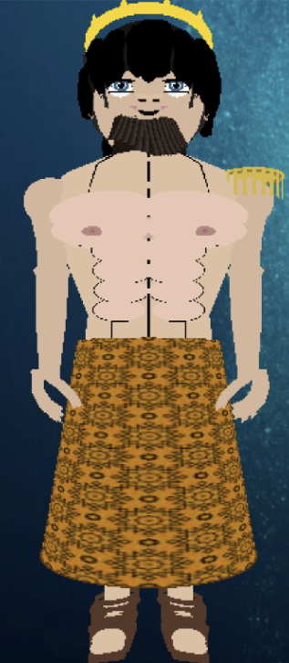
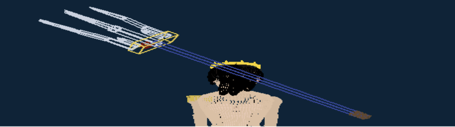
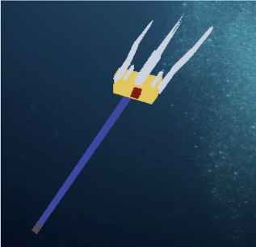

# Character Design and User Manual

## 🎨 Design Concept
This project features a custom-designed 3D character with dynamic animations, weapon handling, lighting effects, and view controls.  
The design is inspired by mythological aesthetics, integrating a **Trident** weapon and orbiting elements for added realism.

### Character View 1

### Character View 2

### Character View 3

### Weapon (Trident)
A detailed trident designed as the character’s primary weapon.  
It can be equipped, holstered, and used for powerful attacks.

### Orbit
An orbiting effect surrounds the character.  
It has multiple modes that can be switched dynamically during gameplay.

---

## 📖 User Manual

### 1. Walking
| **Keyboard Input** | **Description** |
|---------------------|-----------------|
| **W** | Shifts from idle to a forward walk with footsteps and animation (continuous while held). |
| **A** | Shifts from idle to a leftward walk with footsteps and animation (continuous while held). |
| **S** | Shifts from idle to a backward walk with footsteps and animation (continuous while held). |
| **D** | Shifts from idle to a rightward walk with footsteps and animation (continuous while held). |

---

### 2. Weapon Equip and Animation
| **Keyboard Input** | **Description** |
|---------------------|-----------------|
| **B** | Equips the Trident from the back to the right hand. Press again to holster it. |
| **Z** | Jump forward and perform a circular Trident swing with sound and swirling visual effect. |
| **X** | Hold to charge attack (visual vibration). Release to unleash a sweeping shockwave with sound effect. |
| **C** | Fires ~20 bubble-like projectiles with sound effect. |

---

### 3. Animation Moves
| **Keyboard Input** | **Description** |
|---------------------|-----------------|
| **1** | Rotates the wrist (no weapon equipped). |
| **2** | Moves elbow joint up/down (no weapon equipped). |
| **3** | Moves shoulder joint up/down (no weapon equipped). |
| **4** | Head animation: odd presses = horizontal shake, even presses = vertical shake. |
| **5** | Marches on the ground. |
| **6** | Squats down / stand up (no bow or weapon equipped). |
| **7** | Jump action: squat → jump → land (no bow or squat active). |
| **8** | Bow action, press again to return to normal (no weapon equipped). |
| **9** | Switches orbit rotation modes (3 total). |

---

### 4. Lightning
| **Keyboard Input** | **Description** |
|---------------------|-----------------|
| **L** | Toggles lighting effects (must be ON for other light controls). |
| **Y** | Shifts light focus to the **front**. |
| **I** | Shifts light focus to the **back**. |
| **U** | Shifts light focus **upward**. |
| **J** | Shifts light focus **downward**. |
| **H** | Shifts light focus to the **right**. |
| **K** | Shifts light focus to the **left**. |

---

### 5. Texture, Armor and Wireframe
| **Keyboard Input** | **Description** |
|---------------------|-----------------|
| **N** | Cycles through 5 textures: Normal → Army Style → Wooden → Brick → Army Style 2. |
| **V** | Equips armor (body and hand). Press again to unequip. Disabled if wireframe is active. |
| **0** | Enables **wireframe mode**, showing only the structural lines of the model. |

---

### 6. View Changing (OP, Mouse Drag)
| **Input** | **Description** |
|-----------|-----------------|
| **Mouse Drag** | Rotate view based on drag direction (Right = rotate left, Left = rotate right, Up = tilt down, Down = tilt up). |
| **O** | Switches to **Orthographic view**. |
| **P** | Switches to **Perspective view**. |
| **T** | Zoom in (Perspective mode only). |
| **G** | Zoom out (Perspective mode only). |
| **[** | Move near plane closer (Perspective mode). |
| **]** | Move far plane further (Perspective mode). |
| **,** | Rotate camera counterclockwise on Y-axis (Perspective mode). |
| **.** | Rotate camera clockwise on Y-axis (Perspective mode). |
| **;** | Rotate camera counterclockwise on X-axis (Perspective mode). |
| **'** | Rotate camera clockwise on X-axis (Perspective mode). |
| **← / →** | Move camera horizontally. |
| **↑ / ↓** | Move camera vertically. |

---

### 7. Reset Space
| **Keyboard Input** | **Description** |
|---------------------|-----------------|
| **Spacebar** | Resets character and environment to default state. |

---

## 📌 Notes
- All animations are bound to sound effects for realism.  
- Weapon mechanics, lighting, and orbit features enhance immersion.  
- Supports both orthographic and perspective camera modes.  
- Wireframe mode allows inspection of model structure.
